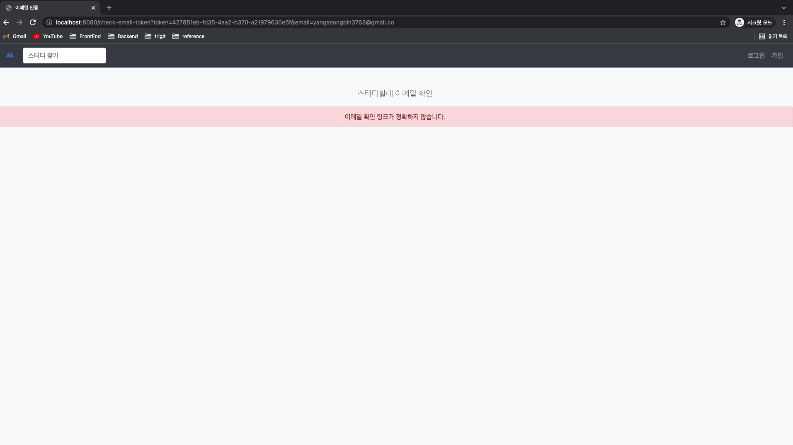
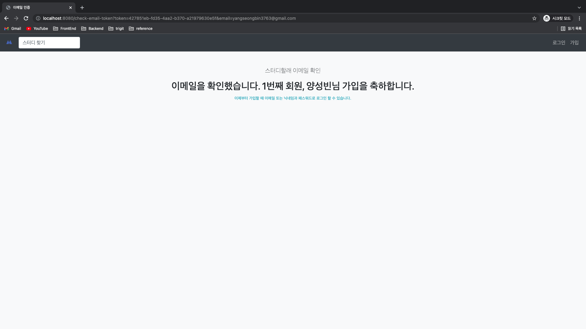
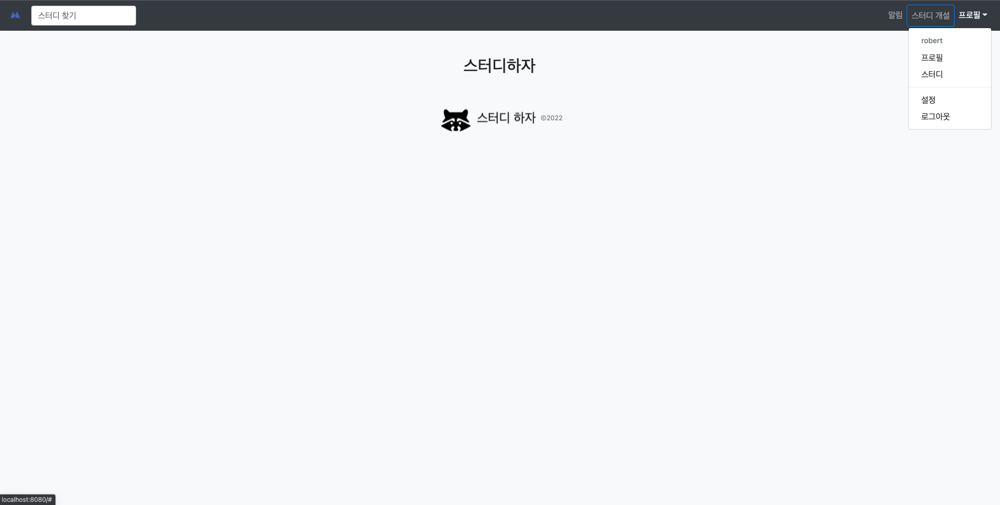
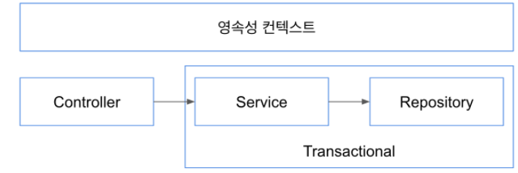
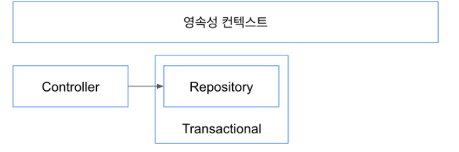
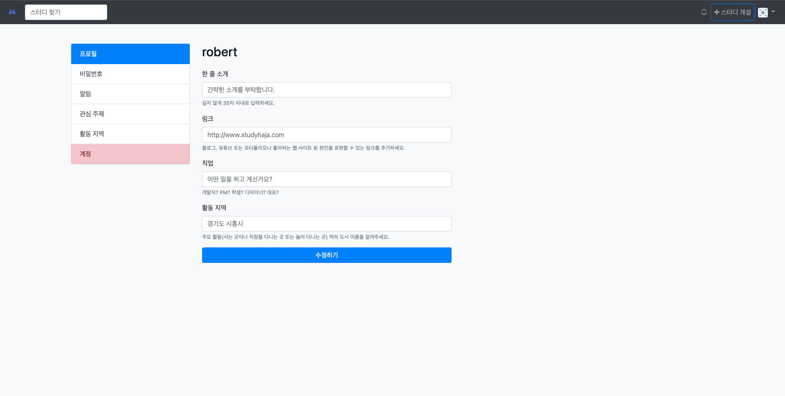
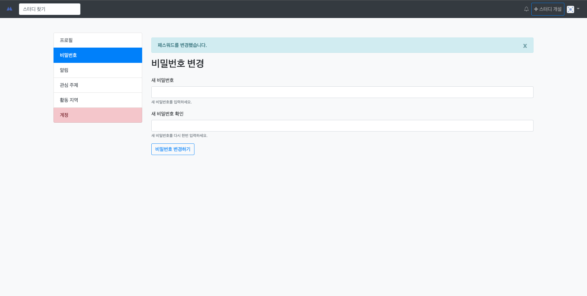
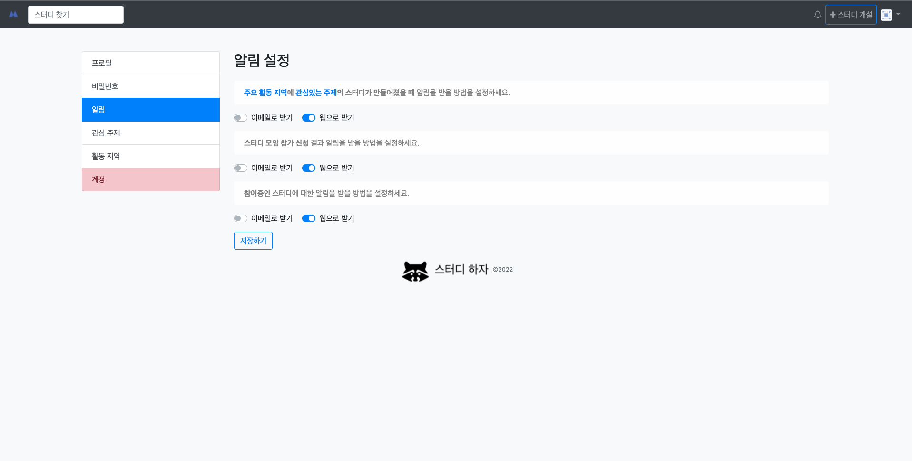
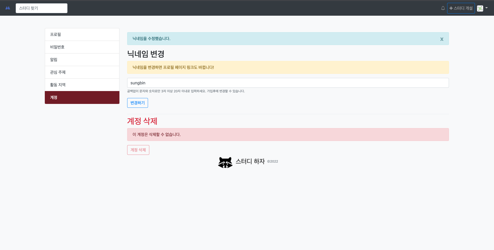

## 기초 점검
- 자바
    * final
    * static
    * equals / hashCode / toString
    * constructor
- 웹
    * HTML
    * CSS
    * JavaScript
    * JQuery
- 스프링
    * 스프링 부트
    * 스프링 MVC
    * 스프링 데이터 JPA
    * 스프링 시큐리티
- JPA
    * Transient / Persistent / Detached / Deleted
    * DBMS 설치 / 유저 또는 롤을 생성 / 데이터베이스 생성 / 권한 설정.
    * left join

## 인텔리J
- 인텔리J 단축키
    * 코드 생성
    * 소스 코드와 테스트 코드 이동 (또는 생성)
    * 퀵픽스
    * 클래스 찾기
    * 리팩토링
        * 리네임 리팩토링
        * 메소드 빼내기
        * 변수로 빼내기

## Git
- Git
    * checkout
        * 커밋 이동
        * 브랜치 이동
        * 브랜치 생성
    * stash
        * 변경 사항 다른 곳에 담아두기
        * 다시 적용하기

## 빌드툴
- 메이븐
    * 페이즈
    * 골
    * 의존성 추가
    * 인텔리J에서 리프레시

## 계정 관리 기능 구상
- 회원 가입
- 이메일 인증
- 로그인
- 로그아웃
- 프로필 추가 정보 입력
- 프로필 이미지 등록
- 알림 설정
- 패스워드 수정
- 패스워드를 잊어버렸습니다
- 관심 주제(태그) 등록
- 주요 활동 지역 등록

## 프로젝트 만들기
- IDE
    * 인텔리J 얼티메이트
- 빌드
    * 메이븐
- 라이브러리
    * 스프링 부트
    * 스프링 웹 MVC
    * 타임리프 (뷰 템플릿)
    * 스프링 시큐리티
    * 스프링 데이터 JPA
    * H2
    * PostgreSQL
    * 롬복
    * 스프링 mail
    * QueryDSL
    * 스프링 부트 devtools

## Account 도메인 클래스
- Account 도메인에 필요한 데이터
  * 로그인
  * 프로필
  * 알림 설정

## 회원 가입: 컨트롤러
- 목표
  * GET “/sign-up” 요청을 받아서 account/sign-up.html 페이지 보여준다.
  * 회원 가입 폼에서 입력 받을 수 있는 정보를 “닉네임", “이메일", “패스워드" 폼 객체로 제공한다.

## 회원 가입: 뷰
- [부트스트랩](https://getbootstrap.com/)
  * 네비게이션 바 만들기
  * 폼 만들기
- [타임리프](https://www.thymeleaf.org/)
  * SignUpForm 타입 객체를 폼 객체로 설정하기
- 웹(HTML, CSS, JavaScript)
  * [제약 검증 기능](https://developer.mozilla.org/en-US/docs/Web/Guide/HTML/Constraint_validation) 사용하기
    * 닉네임 (3~20자, 필수 입력)
    * 이메일 (이메일 형식, 필수 입력)
    * 패스워드 (8~50자, 필수 입력)

## 회원 가입: 폼 서브밋 검증
- 회원 가입 폼 검증
  * JSR 303 애노테이션 검증
    * 값의 길이, 필수값
  * 커스텀 검증
    * 중복 이메일, 닉네임 여부 확인
  * 폼 에러 있을 시, 폼 다시 보여주기.

## 회원 가입: 폼 서브밋 처리
- 회원 가입 처리
  * 회원 정보 저장
  * 인증 이메일 발송
  * 처리 후 첫 페이지로 리다이렉트 ([Post-Redirect-Get](https://en.wikipedia.org/wiki/Post/Redirect/Get) 패턴)

## 회원 가입: 리팩토링 및 테스트
- 리팩토링 하기전에 테스트 코드를 먼저 작성하자.
  * 그래야 코드를 변경한 이후에 불안하지 않다.
  * 변경한 코드가 무언가를 깨트리지 않았다는 것을 확인할 수 있다.
- 테스트 할 것
  * 폼에 이상한 값이 들어간 경우에 다시 폼이 보여지는가?
  * 폼에 값이 정상적인 경우 
    * 가입한 회원 데이터나 존재하는가?
    * 이메일이 보내지는가?
- 리팩토링
  * 메소드가 너무 길지 않은가?
  * 코드를 읽기 쉬운가?
    * 내가 작성한 코드를 내가 읽기 어렵다면 남들에겐 훨씬 더 어렵다.
  * 코드가 적절한 위치에 있는가?
    * 객체들 사이의 의존 관계
    * 책임이 너무 많진 않은지

## 회원 가입: 패스워드 인코더
- 절대로 패스워드를 평문으로 저장해서는 안 됩니다.
  * Account 엔티티를 저장할 때 패스워드 인코딩하기
- 스프링 시큐리티 권장 PasswordEncoder
  * PasswordEncoderFactories.createDelegatingPasswordEncoder()
  * 여러 해시 알고리듬을 지원하는 패스워드 인코더
  * 기본 알고리듬 bcrypt
- 해싱 알고리듬(bcrypt)과 솔트(salt)
  * 해싱 알고리듬을 쓰는 이유?
  * 솔트를 쓰는 이유?

## 회원 가입: 인증 메일 확인
- GET “/check-email-token” token=${token} email=${email} 요청 처리
  * 이메일이 정확하지 않은 경우에 대한 에러 처리
  * 토큰이 정확하지 않은 경우에 대한 에러 처리
  * 이메일과 토큰이 정확한 경우 가입 완료 처리
    * 가입 일시 설정
    * 이메일 인증 여부 true로 설정
- 인증 확인 뷰
  * 입력값에 오류가 있는 경우 적절한 메시지 출력.
  * 인증이 완료된 경우, 환영 문구와 함께 몇번째 사용자인지 보여줄 것.





## 회원 가입: 인증 메일 확인 테스트 및 리팩토링
- 테스트
  * 입력값이 잘못 된 경우
    * error 프로퍼티가 model에 들어있는지 확인
    * 뷰 이름이 account/checkd-email 인지 확인
  * 입력값이 올바른 경우
    * 모델에 error가 없는지 확인
    * 모델에 numberOfUser가 있는지 확인
    * 모델에 nickname이 있는지 확인
    * 뷰 이름 확인
- 리팩토링
  * 코드의 위치가 적절한가?

## 회원 가입: 가입 완료 후 자동 로그인
- 목표
  * 회원 가입 완료시 자동 로그인
  * 이메일 인증 완료시 자동 로그인
- 스프링 시큐리티 관점에서 로그인
  * SecurityContext에 Authentication(Token)이 존재하는가?
  * UsernamePasswordAuthenticationToken

## 회원 가입: 메인 네비게이션 메뉴 변경
- 네비게이션 뷰
  * 인증 정보가 없는 경우
  * 인증 정보가 있는 경우
- 타임리프 스프링 시큐리티

```xml
        <dependency>
            <groupId>org.thymeleaf.extras</groupId>
            <artifactId>thymeleaf-extras-springsecurity5</artifactId>
        </dependency>
```

- 인증 정보가 없는 경우
  * 로그인 / 가입 버튼 보여주기
-인증 정보가 있는 경우
  * 알림 / 스터디 개설 / 프로필 드랍다운 메뉴 보여주기



## 프론트엔드 라이브러리 설정
- WebJar vs NPM
  * WebJar 보다는 NPM 선호.
  * WebJar는 라이브러리 업데이트가 느리다. 심지어 제공하지 않는 라이브러리도 많다.
- 스프링 부트와 NPM
  * src/main/resources/static 디렉토리 이하는 정적 리소스로 제공한다. (스프링 부트)
  * package.json에 프론트엔드 라이브러리를 제공한다.
  * 이 둘을 응용하면, 즉 static 디렉토리 아래에 package.json을 사용해서 라이브러리를 받아오면 정적 리소스로 프론트엔드 라이브러리를 사용할 수 있다.
- 고려해야 할 점
  * 빌드
  * 버전관리
  * 시큐리티 설정
- 빌드
  * 메이븐 pom.xml을 빌드할 때 static 디렉토리 아래에 있는 package.json도 빌드하도록 설정해야 한다.
  * 빌드를 안하면 프론트엔드 라이브러리를 받아오지 않아서 뷰에서 필요한 참조가 끊어지고 화면이 제대로 보이지 않는다.

  ```xml
              <plugin>
                  <groupId>com.github.eirslett</groupId>
                  <artifactId>frontend-maven-plugin</artifactId>
                  <version>1.8.0</version>
                  <configuration>
                      <nodeVersion>v14.16.1</nodeVersion>
                      <workingDirectory>src/main/resources/static</workingDirectory>
                  </configuration>
                  <executions>
                      <execution>
                          <id>install node and npm</id>
                          <goals>
                              <goal>install-node-and-npm</goal>
                          </goals>
                          <phase>generate-resources</phase>
                      </execution>
                      <execution>
                          <id>npm install</id>
                          <goals>
                              <goal>npm</goal>
                          </goals>
                          <phase>generate-resources</phase>
                          <configuration>
                              <arguments>install</arguments>
                          </configuration>
                      </execution>
                  </executions>
              </plugin>
  ```
  
- 버전 관리
  * 빌드해서 생성되는 파일이나 디렉토리는 .gitignore 파일에 명시하여 버전관리에서 제외한다.
  
  ```gitignore
  ### NPM ###
  src/main/resources/static/node_modules
  src/main/resources/static/node
  ```
  
- 시큐리티 설정
  * /node_modules/** 요청에는 시큐리티 필터를 적용하지 않도록 설정한다.

```java
@Override
public void configure(WebSecurity web) throws Exception {
    web.ignoring()
            .mvcMatchers("/node_modules/**")
            .requestMatchers(PathRequest.toStaticResources().atCommonLocations());
}
```

## 뷰 중복 코드 제거
- 타임리프 프레그먼트 (Fragement) 사용하기
  * https://www.thymeleaf.org/doc/tutorials/3.0/usingthymeleaf.html#including-template-fragments
  * 프레그먼트 정의
    * th:fragement 
  * 프레그먼트 사용
    * th:insert 
    * th:replace
- 뷰 중복 코드
  * 메인 네비게이션
  * 하단 (footer)
  * 헤더 (head)

## 첫 페이지 보완
- 이번에 할 일
  * 네비게이션 바에 [Fontawesome](https://fontawesome.com/) 으로 아이콘 추가
  * 이메일 인증을 마치지 않은 사용자에게 메시지 보여주기
  * [jdenticon](https://jdenticon.com/) 으로 프로필 기본 이미지 생성하기
- NPM으로 프론트엔f드 라이브러리 설치
  * npm install font-awesome
  * npm install jdenticon
- 폰트어썸 아이콘 사용하기
  * <i class=”fa fa-XXXX”></i>
- Jdenticon으로 아바타 생성하기
  * <svg width="80" height="80" data-jdenticon-value="user127"></svg>
- 타임리프 조건문
  * th:if
- 부트스트랩 경고창

```html
<div class="alert alert-warning" role="alert" th:if="${account != null && !account?.emailVerified}">
    스터디올레 가입을 완료하려면 <a href="#" th:href="@{/check-email}" class="alert-link">계정 인증 이메일을 확인</a>하세요.
</div>
```

## 현재 인증된 사용자 정보 참조
- 스프링 시큐리티의 스프링 웹 MVC 지원
  * @AuthenticationPrincipal
    * 핸들러 매개변수로 현재 인증된 Principal을 참조할 수 있다.
  * Princial을 어디에 넣을까?

  ```java
      public void login(Account account) {
          UsernamePasswordAuthenticationToken token = new UsernamePasswordAuthenticationToken(
                  account.getNickname(),
                  account.getPassword(),
                  List.of(new SimpleGrantedAuthority("ROLE_USER")));
          SecurityContextHolder.getContext().setAuthentication(token);
      }
  ```
  
  * @AuthenticationPricipal은 SpEL을 사용해서 Principal 내부 정보에 접근할 수도 있다.

  ```java
  @AuthenticationPrincipal(expression = "#this == 'anonymousUser' ? null : account")
  ```
  
  * 익명 인증인 경우에는 null로 설정하고, 아닌 경우에는 account 프로퍼티를 조회해서 설정하라.

## 가입 확인 이메일 재전송
- 구현한 로직
  * 가입 확인 이메일을 재전송할 수 있는 기능 제공
  * 하지만, 너무 자주 이메일을 전송할 경우 리소스를 낭비할 수 있다는 문제가 있음
  * 보완책으로, 1시간에 한번만 인증 메일을 전송할 수 있도록 제한한다.
- GET “/check-email”
  * 가입 확인 이메일을 전송한 이메일 주소 (== 가입할 때 입력한 이메일 주소)를 화면에 보여줌.
  * 재전송 버튼 보여주기.
  * 재전송 버튼 클릭하면 GET “/resend-confirm-email” 요청 전송
- GET “/resend-confirm-email”
  * 인증 메일을 다시 전송할 수 있는지 확인한 뒤에
  * 보낼 수 있으면 전송하고, 첫 페이지로 리다이렉트
  * 보낼 수 없으면 에러 메시지를 모델에 담아주고 이메일 확인 페이지 다시 보여주기.

## 로그인 / 로그아웃
- 커스텀 로그인 페이지 만들기
- 스프링 시큐리티 로그인/로그아웃 설정

```java
@Override
protected void configure(HttpSecurity http) throws Exception {
        http
        .authorizeRequests()
        .mvcMatchers("/", "/login", "/sign-up", "/check-email-token", "/email-login",
        "/check-email-login", "/login-link").permitAll()
        .mvcMatchers(HttpMethod.GET, "/profile/*").permitAll()
        .anyRequest().authenticated()
        .and()
        .formLogin()
        .loginPage("/login").permitAll()
        .and()
        .logout()
        .logoutSuccessUrl("/");
        }
```

- 스프링 시큐리티 로그인 기본값
  * username
  * password
  * POST “/login”

## 로그인 / 로그아웃 테스트
- 테스트 요점 정리
  * 폼 서브밋 요청 (post)은 반드시 .with(csrf())를 추가할 것.
  * .andExpect(authenticated()) 또는 .andExpect(unauthenticated())로 인증 여부를 확인할 수 있다.
  * 리다이렉트 응답은 .andExpect(status().is3xxRedirection()) 로 확인한다.
  * 리다이렉트 URL은 .andExpect(redirectedUrl()) 로 확인할 수 있다.
  * JUnit 5의 @BeforeEach와 @AfterEach.
  * 임의로 로그인 된 사용자가 필요한 경우에는 @WithMockUser.

## 로그인 기억하기 (RememberMe)
- 세션이 만료 되더라도 로그인을 유지하고 싶을 때 사용하는 방법
  * 쿠키에 인증 정보를 남겨두고 세션이 만료 됐을 때에는 쿠키에 남아있는 정보로 인증한다.
- 해시 기반의 쿠키
  * Username
  * Password
  * 만료 기간
  * Key (애플리케이션 마다 다른 값을 줘야 한다.)
  * 치명적인 단점, 쿠키를 다른 사람이 가져가면... 그 계정은 탈취당한 것과 같다.
- 조금 더 안전한 방법은?
  * 쿠키안에 랜덤한 문자열(토큰)을 만들어 같이 저장하고 매번 인증할 때마다 바꾼다.
  * Username, 토큰
  * 문제는, 이 방법도 취약하다. 쿠키를 탈취 당하면, 해커가 쿠키로 인증을 할 수 있고, 희생자는 쿠키로 인증하지 못한다.
- 조금 더 개선한 방법
  * https://www.programering.com/a/MDO0MzMwATA.html
  * Username, 토큰(랜덤, 매번 바뀜), 시리즈(랜덤, 고정)
  * 쿠키를 탈취 당한 경우, 희생자는 유효하지 않은 토큰과 유효한 시리즈와 Username으로 접속하게 된다.
  * 이 경우, 모든 토큰을 삭제하여 해커가 더이상 탈취한 쿠키를 사용하지 못하도록 방지할 수 있다.
- 스프링 시큐리티 설정: 해시 기반 설정

  ```java
  http.rememberMe().key("랜덤한 키 값")
  ```

  * https://docs.spring.io/spring-security/site/docs/current/reference/html5/#remember-me-hash-token
- 스프링 시큐리티 설정: 보다 안전한 영속화 기반 설정

```java
http.rememberMe()
        .userDetailsService(accountService)
        .tokenRepository(tokenRepository());

@Bean
public PersistentTokenRepository tokenRepository() {
    JdbcTokenRepositoryImpl jdbcTokenRepository = new JdbcTokenRepositoryImpl();
    jdbcTokenRepository.setDataSource(dataSource);
    return jdbcTokenRepository;
}
```

- persistent_logins 테이블 만들기

```sql
create table persistent_logins (username varchar(64) not null, series varchar(64) primary key, token varchar(64) not null, last_used timestamp not null)
```

- 또는 @Entity 맵핑으로 생성.

## 프로필 뷰
- 정보가 없는 프로필 뷰
- 정보가 있는 프로필 뷰
  * 정보의 유/무 여부에 따라 보여줄 메시지가 다르다.
  * 현재 유저가 프로필을 수정할 수 있는 권한이 있는지 판단해야 한다.
- 부트스트랩
  * [ListGroup](https://getbootstrap.com/docs/4.4/components/list-group/)
  * [Grid](https://getbootstrap.com/docs/4.4/layout/grid/)

## Open EntityManager (또는 Session) In View 필터
- JPA EntityManager(영속성 컨텍스트)를 요청을 처리하는 전체 프로세스에 바인딩 시켜주는 필터.
  * 뷰를 랜더링 할때까지 영속성 컨텍스트를 유지하기 때문에 필요한 데이터를 랜더링 하는 시점에 추가로 읽어올 수 있다. (지연 로딩, Lazy Loading)
  * 엔티티 객체 변경은 반드시 트랜잭션 안에서 할 것
    * 그래야 트랜잭션 종료 직전 또는 필요한 시점에 변경 사항을 DB에 반영
- 현재 버그
  * 컨트롤러에서 데이터를 변경했다. 왜 DB에 반영되지 않았을까?
    * 트랜잭션 범위 밖에서 일어난 일이기 때문에!
- 서비스에서 트랜잭션 관리하는 경우



- 리파지토리 직접 사용 경우



- 스터디하자의 선택
  * 데이터 변경은 서비스 계층으로 위임해서 트랜잭션안에서 처리한다.
  * 데이터 조회는 리파지토리 또는 서비스를 사용한다.

## 프로필 수정 폼
- 프로필 수정 뷰



- 컨트롤러
  * Bio, Link, Occupation, Location 정보만 입력받아서 Account 정보를 수정한다.

## 프로필 수정 처리
- 정말로 쉬운 폼 처리
  * 비어있는 값을 허용한다. (기존에 있던 값을 삭제하고 싶을 수도 있기 때문에..)
  * 중복된 값을 고민하지 않아도 된다.
  * 확인할 내용은 입력 값의 길이 정도.
- 폼 처리
  * 에러가 있는 경우 폼 다시 보여주기.
    * 에러가 없는 경우
      * 저장하고,
      * 프로필 수정 페이지 다시 보여주기. (리다이렉트)
      * 수정 완료 메시지.
- 리다이렉트시에 간단한 데이터를 전달하고 싶다면?
  * RedirectAttributes.addFlashAttribute()
  * https://docs.spring.io/spring/docs/current/javadoc-api/org/springframework/web/servlet/mvc/support/RedirectAttributes.html

## 프로필 수정 테스트
- 인증된 사용자가 접근할 수 있는 기능 테스트하기
  * 실제 DB에 저장되어 있는 정보에 대응하는 인증된 Authentication이 필요하다.
  * @WithMockUser로는 처리할 수 없다.
- 인증된 사용자를 제공할 커스텀 애노테이션 만들기
  * @WithAccount
  * https://docs.spring.io/spring-security/site/docs/current/reference/html/test.html
- 커스텀 애노테이션 생성

```java
@Retention(RetentionPolicy.RUNTIME)
@WithSecurityContext(factory = WithAccountSecurityContextFacotry.class)
public @interface WithAccount {

    String value();

}
```

- SecurityContextFactory 구현

```java
public class WithAccountSecurityContextFacotry implements WithSecurityContextFactory<WithAccount> {

// 빈을 주입 받을 수 있다.

// Authentication 만들고 SecurityuContext에 넣어주기

        UserDetails principal = accountService.loadUserByUsername(nickname);
        Authentication authentication = new UsernamePasswordAuthenticationToken(principal, principal.getPassword(), principal.getAuthorities());
        SecurityContext context = SecurityContextHolder.createEmptyContext();
        context.setAuthentication(authentication);

}
```

## 프로필 이미지 변경
- 아바타 이미지 잘라서 저장하기
- 프론트 라이브러리 설치
  * [Cropper.JS](https://fengyuanchen.github.io/cropperjs/)
  * npm install cropper
  * npm install jquery-cropper
- Cropper.js 사용하기

```javascript
$("#profile-image-file").change(function(e) {
  if (e.target.files.length === 1) {
    const reader = new FileReader();
    reader.onload = e => {
      if (e.target.result) {
        let img = document.createElement("img");
        img.id = 'new-profile';
        img.src = e.target.result;
        img.width = 250;

        $newProfileImage.html(img);
        $newProfileImage.show();
        $currentProfileImage.hide();

        let $newImage = $(img);
        $newImage.cropper({aspectRatio: 1});
        cropper = $newImage.data('cropper');

        $cutBtn.show();
        $confirmBtn.hide();
        $resetBtn.show();
      }
    };

    reader.readAsDataURL(e.target.files[0]);
  }
});
```

- [DataURL](https://developer.mozilla.org/en-US/docs/Web/HTTP/Basics_of_HTTP/Data_URIs) 이란?
  * data: 라는 접두어를 가진 URL로 파일을 문서에 내장 시킬때 사용할 수 있다.
  * 이미지를 DataURL로 저장할 수 있다.

## 패스워드 수정
- 패스워드 변경 뷰



- 패스워드 변경
  * 패스워드 탭 활성화.
  * 새 패스워드와 새 패스워드 확인의 값이 일치해야 한다.
  * 패스워드 인코딩 할 것!
  * 둘 다 최소 8자에서 최대 50자 사이.
  * 사용자 정보를 변경하는 작업.
    * 서비스로 위임해서 트랜잭션 안에서 처리해야 한다.
    * 또는 Detached 상태의 객체를 변경한 다음 Repositoiry의 save를 호출해서 상태 변경 내역을 적용 할 것(Merge)

## 패스워드 수정 테스트

## 알림 설정
- 알림 설정 뷰



- 알림 설정
  * 특정 웹 서비스 이벤트(스터디 생성, 참가 신청 결과, 참여중인 스터디)에 대한 정보를 이메일로 받을지, 웹 알림 메시지로 받을지 선택하는 기능. 물론 둘 다 받을 수도 있음.
- 부트스트랩
  * [Form](https://getbootstrap.com/docs/4.4/components/forms/)

## ModelMapper 적용
- http://modelmapper.org/
  * 객체의 프로퍼티를 다른 객체의 프로퍼티로 맵핑해주는 유틸리티
- 의존성 추가

```xml
        <dependency>
            <groupId>org.modelmapper</groupId>
            <artifactId>modelmapper</artifactId>
            <version>3.1.0</version>
        </dependency>
```

- 토크나이저 설정

  ```java
  modelMapper.getConfiguration()
    .setSourceNameTokenizer(NameTokenizers.UNDERSCORE)
    .setDestinationNameTokenizer(NameTokenizers.UNDERSCORE)
  ```
  
  * UNDERSCORE(_)를 사용했을 때에만 nested 객체를 참조하는 것으로 간주하고 그렇지 않은 경우에는 해당 객체의 직속 프로퍼티에 바인딩 한다.
  * http://modelmapper.org/user-manual/configuration/#matching-strategies

## 닉네임 수정
- 계정 관리 뷰



- 닉네임 수정
  * 닉네임은 특정 패턴("^[ㄱ-ㅎ가-힣a-z0-9_-]{3,20}$")의 문자열만 지원 함.
  * 중복 닉네임 확인.

## 패스워드를 잊어버렸습니다
- 패스워드를 잊은 경우에는 “로그인 할 수 있는 링크”를 이메일로 전송한다. 이메일로 전송된 링크를 클릭하면 로그인한다.
- GET /email-login
  * 이메일을 입력할 수 있는 폼을 보여주고, 링크 전송 버튼을 제공한다.
- POST /email-login
  * 입력받은 이메일에 해당하는 계정을 찾아보고, 있는 계정이면 로그인 가능한 링크를 이메일로 전송한다.
  * 이메일 전송 후, 안내 메시지를 보여준다.
- GET /login-by-email
  * 토큰과 이메일을 확인한 뒤 해당 계정으로 로그인한다.