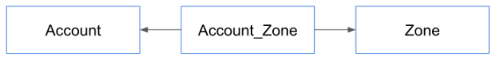
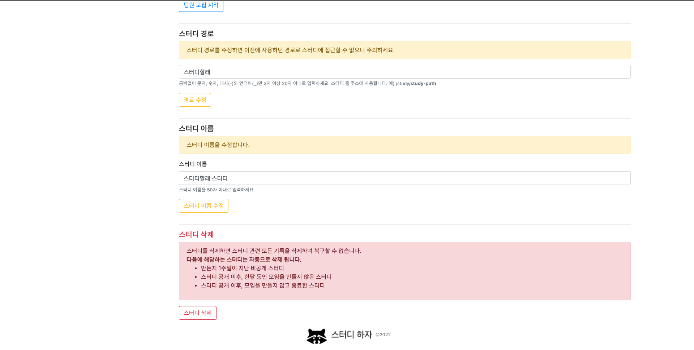

## 기초 점검
- 자바
    * final
    * static
    * equals / hashCode / toString
    * constructor
- 웹
    * HTML
    * CSS
    * JavaScript
    * JQuery
- 스프링
    * 스프링 부트
    * 스프링 MVC
    * 스프링 데이터 JPA
    * 스프링 시큐리티
- JPA
    * Transient / Persistent / Detached / Deleted
    * DBMS 설치 / 유저 또는 롤을 생성 / 데이터베이스 생성 / 권한 설정.
    * left join

## 인텔리J
- 인텔리J 단축키
    * 코드 생성
    * 소스 코드와 테스트 코드 이동 (또는 생성)
    * 퀵픽스
    * 클래스 찾기
    * 리팩토링
        * 리네임 리팩토링
        * 메소드 빼내기
        * 변수로 빼내기

## Git
- Git
    * checkout
        * 커밋 이동
        * 브랜치 이동
        * 브랜치 생성
    * stash
        * 변경 사항 다른 곳에 담아두기
        * 다시 적용하기

## 빌드툴
- 메이븐
    * 페이즈
    * 골
    * 의존성 추가
    * 인텔리J에서 리프레시

## 계정 관리 기능 구상
- 회원 가입
- 이메일 인증
- 로그인
- 로그아웃
- 프로필 추가 정보 입력
- 프로필 이미지 등록
- 알림 설정
- 패스워드 수정
- 패스워드를 잊어버렸습니다
- 관심 주제(태그) 등록
- 주요 활동 지역 등록

## 프로젝트 만들기
- IDE
    * 인텔리J 얼티메이트
- 빌드
    * 메이븐
- 라이브러리
    * 스프링 부트
    * 스프링 웹 MVC
    * 타임리프 (뷰 템플릿)
    * 스프링 시큐리티
    * 스프링 데이터 JPA
    * H2
    * PostgreSQL
    * 롬복
    * 스프링 mail
    * QueryDSL
    * 스프링 부트 devtools

## Account 도메인 클래스
- Account 도메인에 필요한 데이터
  * 로그인
  * 프로필
  * 알림 설정

## 회원 가입: 컨트롤러
- 목표
  * GET “/sign-up” 요청을 받아서 account/sign-up.html 페이지 보여준다.
  * 회원 가입 폼에서 입력 받을 수 있는 정보를 “닉네임", “이메일", “패스워드" 폼 객체로 제공한다.

## 회원 가입: 뷰
- [부트스트랩](https://getbootstrap.com/)
  * 네비게이션 바 만들기
  * 폼 만들기
- [타임리프](https://www.thymeleaf.org/)
  * SignUpForm 타입 객체를 폼 객체로 설정하기
- 웹(HTML, CSS, JavaScript)
  * [제약 검증 기능](https://developer.mozilla.org/en-US/docs/Web/Guide/HTML/Constraint_validation) 사용하기
    * 닉네임 (3~20자, 필수 입력)
    * 이메일 (이메일 형식, 필수 입력)
    * 패스워드 (8~50자, 필수 입력)

## 회원 가입: 폼 서브밋 검증
- 회원 가입 폼 검증
  * JSR 303 애노테이션 검증
    * 값의 길이, 필수값
  * 커스텀 검증
    * 중복 이메일, 닉네임 여부 확인
  * 폼 에러 있을 시, 폼 다시 보여주기.

## 회원 가입: 폼 서브밋 처리
- 회원 가입 처리
  * 회원 정보 저장
  * 인증 이메일 발송
  * 처리 후 첫 페이지로 리다이렉트 ([Post-Redirect-Get](https://en.wikipedia.org/wiki/Post/Redirect/Get) 패턴)

## 회원 가입: 리팩토링 및 테스트
- 리팩토링 하기전에 테스트 코드를 먼저 작성하자.
  * 그래야 코드를 변경한 이후에 불안하지 않다.
  * 변경한 코드가 무언가를 깨트리지 않았다는 것을 확인할 수 있다.
- 테스트 할 것
  * 폼에 이상한 값이 들어간 경우에 다시 폼이 보여지는가?
  * 폼에 값이 정상적인 경우 
    * 가입한 회원 데이터나 존재하는가?
    * 이메일이 보내지는가?
- 리팩토링
  * 메소드가 너무 길지 않은가?
  * 코드를 읽기 쉬운가?
    * 내가 작성한 코드를 내가 읽기 어렵다면 남들에겐 훨씬 더 어렵다.
  * 코드가 적절한 위치에 있는가?
    * 객체들 사이의 의존 관계
    * 책임이 너무 많진 않은지

## 회원 가입: 패스워드 인코더
- 절대로 패스워드를 평문으로 저장해서는 안 됩니다.
  * Account 엔티티를 저장할 때 패스워드 인코딩하기
- 스프링 시큐리티 권장 PasswordEncoder
  * PasswordEncoderFactories.createDelegatingPasswordEncoder()
  * 여러 해시 알고리듬을 지원하는 패스워드 인코더
  * 기본 알고리듬 bcrypt
- 해싱 알고리듬(bcrypt)과 솔트(salt)
  * 해싱 알고리듬을 쓰는 이유?
  * 솔트를 쓰는 이유?

## 회원 가입: 인증 메일 확인
- GET “/check-email-token” token=${token} email=${email} 요청 처리
  * 이메일이 정확하지 않은 경우에 대한 에러 처리
  * 토큰이 정확하지 않은 경우에 대한 에러 처리
  * 이메일과 토큰이 정확한 경우 가입 완료 처리
    * 가입 일시 설정
    * 이메일 인증 여부 true로 설정
- 인증 확인 뷰
  * 입력값에 오류가 있는 경우 적절한 메시지 출력.
  * 인증이 완료된 경우, 환영 문구와 함께 몇번째 사용자인지 보여줄 것.


## 회원 가입: 인증 메일 확인 테스트 및 리팩토링
- 테스트
  * 입력값이 잘못 된 경우
    * error 프로퍼티가 model에 들어있는지 확인
    * 뷰 이름이 account/checkd-email 인지 확인
  * 입력값이 올바른 경우
    * 모델에 error가 없는지 확인
    * 모델에 numberOfUser가 있는지 확인
    * 모델에 nickname이 있는지 확인
    * 뷰 이름 확인
- 리팩토링
  * 코드의 위치가 적절한가?

## 회원 가입: 가입 완료 후 자동 로그인
- 목표
  * 회원 가입 완료시 자동 로그인
  * 이메일 인증 완료시 자동 로그인
- 스프링 시큐리티 관점에서 로그인
  * SecurityContext에 Authentication(Token)이 존재하는가?
  * UsernamePasswordAuthenticationToken

## 회원 가입: 메인 네비게이션 메뉴 변경
- 네비게이션 뷰
  * 인증 정보가 없는 경우
  * 인증 정보가 있는 경우
- 타임리프 스프링 시큐리티

```xml
        <dependency>
            <groupId>org.thymeleaf.extras</groupId>
            <artifactId>thymeleaf-extras-springsecurity5</artifactId>
        </dependency>
```

- 인증 정보가 없는 경우
  * 로그인 / 가입 버튼 보여주기
-인증 정보가 있는 경우
  * 알림 / 스터디 개설 / 프로필 드랍다운 메뉴 보여주기


## 프론트엔드 라이브러리 설정
- WebJar vs NPM
  * WebJar 보다는 NPM 선호.
  * WebJar는 라이브러리 업데이트가 느리다. 심지어 제공하지 않는 라이브러리도 많다.
- 스프링 부트와 NPM
  * src/main/resources/static 디렉토리 이하는 정적 리소스로 제공한다. (스프링 부트)
  * package.json에 프론트엔드 라이브러리를 제공한다.
  * 이 둘을 응용하면, 즉 static 디렉토리 아래에 package.json을 사용해서 라이브러리를 받아오면 정적 리소스로 프론트엔드 라이브러리를 사용할 수 있다.
- 고려해야 할 점
  * 빌드
  * 버전관리
  * 시큐리티 설정
- 빌드
  * 메이븐 pom.xml을 빌드할 때 static 디렉토리 아래에 있는 package.json도 빌드하도록 설정해야 한다.
  * 빌드를 안하면 프론트엔드 라이브러리를 받아오지 않아서 뷰에서 필요한 참조가 끊어지고 화면이 제대로 보이지 않는다.

  ```xml
              <plugin>
                  <groupId>com.github.eirslett</groupId>
                  <artifactId>frontend-maven-plugin</artifactId>
                  <version>1.8.0</version>
                  <configuration>
                      <nodeVersion>v14.16.1</nodeVersion>
                      <workingDirectory>src/main/resources/static</workingDirectory>
                  </configuration>
                  <executions>
                      <execution>
                          <id>install node and npm</id>
                          <goals>
                              <goal>install-node-and-npm</goal>
                          </goals>
                          <phase>generate-resources</phase>
                      </execution>
                      <execution>
                          <id>npm install</id>
                          <goals>
                              <goal>npm</goal>
                          </goals>
                          <phase>generate-resources</phase>
                          <configuration>
                              <arguments>install</arguments>
                          </configuration>
                      </execution>
                  </executions>
              </plugin>
  ```
  
- 버전 관리
  * 빌드해서 생성되는 파일이나 디렉토리는 .gitignore 파일에 명시하여 버전관리에서 제외한다.
  
  ```gitignore
  ### NPM ###
  src/main/resources/static/node_modules
  src/main/resources/static/node
  ```
  
- 시큐리티 설정
  * /node_modules/** 요청에는 시큐리티 필터를 적용하지 않도록 설정한다.

```java
@Override
public void configure(WebSecurity web) throws Exception {
    web.ignoring()
            .mvcMatchers("/node_modules/**")
            .requestMatchers(PathRequest.toStaticResources().atCommonLocations());
}
```

## 뷰 중복 코드 제거
- 타임리프 프레그먼트 (Fragement) 사용하기
  * https://www.thymeleaf.org/doc/tutorials/3.0/usingthymeleaf.html#including-template-fragments
  * 프레그먼트 정의
    * th:fragement 
  * 프레그먼트 사용
    * th:insert 
    * th:replace
- 뷰 중복 코드
  * 메인 네비게이션
  * 하단 (footer)
  * 헤더 (head)

## 첫 페이지 보완
- 이번에 할 일
  * 네비게이션 바에 [Fontawesome](https://fontawesome.com/) 으로 아이콘 추가
  * 이메일 인증을 마치지 않은 사용자에게 메시지 보여주기
  * [jdenticon](https://jdenticon.com/) 으로 프로필 기본 이미지 생성하기
- NPM으로 프론트엔f드 라이브러리 설치
  * npm install font-awesome
  * npm install jdenticon
- 폰트어썸 아이콘 사용하기
  * <i class=”fa fa-XXXX”></i>
- Jdenticon으로 아바타 생성하기
  * <svg width="80" height="80" data-jdenticon-value="user127"></svg>
- 타임리프 조건문
  * th:if
- 부트스트랩 경고창

```html
<div class="alert alert-warning" role="alert" th:if="${account != null && !account?.emailVerified}">
    스터디올레 가입을 완료하려면 <a href="#" th:href="@{/check-email}" class="alert-link">계정 인증 이메일을 확인</a>하세요.
</div>
```

## 현재 인증된 사용자 정보 참조
- 스프링 시큐리티의 스프링 웹 MVC 지원
  * @AuthenticationPrincipal
    * 핸들러 매개변수로 현재 인증된 Principal을 참조할 수 있다.
  * Princial을 어디에 넣을까?

  ```java
      public void login(Account account) {
          UsernamePasswordAuthenticationToken token = new UsernamePasswordAuthenticationToken(
                  account.getNickname(),
                  account.getPassword(),
                  List.of(new SimpleGrantedAuthority("ROLE_USER")));
          SecurityContextHolder.getContext().setAuthentication(token);
      }
  ```
  
  * @AuthenticationPricipal은 SpEL을 사용해서 Principal 내부 정보에 접근할 수도 있다.

  ```java
  @AuthenticationPrincipal(expression = "#this == 'anonymousUser' ? null : account")
  ```
  
  * 익명 인증인 경우에는 null로 설정하고, 아닌 경우에는 account 프로퍼티를 조회해서 설정하라.

## 가입 확인 이메일 재전송
- 구현한 로직
  * 가입 확인 이메일을 재전송할 수 있는 기능 제공
  * 하지만, 너무 자주 이메일을 전송할 경우 리소스를 낭비할 수 있다는 문제가 있음
  * 보완책으로, 1시간에 한번만 인증 메일을 전송할 수 있도록 제한한다.
- GET “/check-email”
  * 가입 확인 이메일을 전송한 이메일 주소 (== 가입할 때 입력한 이메일 주소)를 화면에 보여줌.
  * 재전송 버튼 보여주기.
  * 재전송 버튼 클릭하면 GET “/resend-confirm-email” 요청 전송
- GET “/resend-confirm-email”
  * 인증 메일을 다시 전송할 수 있는지 확인한 뒤에
  * 보낼 수 있으면 전송하고, 첫 페이지로 리다이렉트
  * 보낼 수 없으면 에러 메시지를 모델에 담아주고 이메일 확인 페이지 다시 보여주기.

## 로그인 / 로그아웃
- 커스텀 로그인 페이지 만들기
- 스프링 시큐리티 로그인/로그아웃 설정

```java
@Override
protected void configure(HttpSecurity http) throws Exception {
        http
        .authorizeRequests()
        .mvcMatchers("/", "/login", "/sign-up", "/check-email-token", "/email-login",
        "/check-email-login", "/login-link").permitAll()
        .mvcMatchers(HttpMethod.GET, "/profile/*").permitAll()
        .anyRequest().authenticated()
        .and()
        .formLogin()
        .loginPage("/login").permitAll()
        .and()
        .logout()
        .logoutSuccessUrl("/");
        }
```

- 스프링 시큐리티 로그인 기본값
  * username
  * password
  * POST “/login”

## 로그인 / 로그아웃 테스트
- 테스트 요점 정리
  * 폼 서브밋 요청 (post)은 반드시 .with(csrf())를 추가할 것.
  * .andExpect(authenticated()) 또는 .andExpect(unauthenticated())로 인증 여부를 확인할 수 있다.
  * 리다이렉트 응답은 .andExpect(status().is3xxRedirection()) 로 확인한다.
  * 리다이렉트 URL은 .andExpect(redirectedUrl()) 로 확인할 수 있다.
  * JUnit 5의 @BeforeEach와 @AfterEach.
  * 임의로 로그인 된 사용자가 필요한 경우에는 @WithMockUser.

## 로그인 기억하기 (RememberMe)
- 세션이 만료 되더라도 로그인을 유지하고 싶을 때 사용하는 방법
  * 쿠키에 인증 정보를 남겨두고 세션이 만료 됐을 때에는 쿠키에 남아있는 정보로 인증한다.
- 해시 기반의 쿠키
  * Username
  * Password
  * 만료 기간
  * Key (애플리케이션 마다 다른 값을 줘야 한다.)
  * 치명적인 단점, 쿠키를 다른 사람이 가져가면... 그 계정은 탈취당한 것과 같다.
- 조금 더 안전한 방법은?
  * 쿠키안에 랜덤한 문자열(토큰)을 만들어 같이 저장하고 매번 인증할 때마다 바꾼다.
  * Username, 토큰
  * 문제는, 이 방법도 취약하다. 쿠키를 탈취 당하면, 해커가 쿠키로 인증을 할 수 있고, 희생자는 쿠키로 인증하지 못한다.
- 조금 더 개선한 방법
  * https://www.programering.com/a/MDO0MzMwATA.html
  * Username, 토큰(랜덤, 매번 바뀜), 시리즈(랜덤, 고정)
  * 쿠키를 탈취 당한 경우, 희생자는 유효하지 않은 토큰과 유효한 시리즈와 Username으로 접속하게 된다.
  * 이 경우, 모든 토큰을 삭제하여 해커가 더이상 탈취한 쿠키를 사용하지 못하도록 방지할 수 있다.
- 스프링 시큐리티 설정: 해시 기반 설정

  ```java
  http.rememberMe().key("랜덤한 키 값")
  ```

  * https://docs.spring.io/spring-security/site/docs/current/reference/html5/#remember-me-hash-token
- 스프링 시큐리티 설정: 보다 안전한 영속화 기반 설정

```java
http.rememberMe()
        .userDetailsService(accountService)
        .tokenRepository(tokenRepository());

@Bean
public PersistentTokenRepository tokenRepository() {
    JdbcTokenRepositoryImpl jdbcTokenRepository = new JdbcTokenRepositoryImpl();
    jdbcTokenRepository.setDataSource(dataSource);
    return jdbcTokenRepository;
}
```

- persistent_logins 테이블 만들기

```sql
create table persistent_logins (username varchar(64) not null, series varchar(64) primary key, token varchar(64) not null, last_used timestamp not null)
```

- 또는 @Entity 맵핑으로 생성.

## 프로필 뷰
- 정보가 없는 프로필 뷰
- 정보가 있는 프로필 뷰
  * 정보의 유/무 여부에 따라 보여줄 메시지가 다르다.
  * 현재 유저가 프로필을 수정할 수 있는 권한이 있는지 판단해야 한다.
- 부트스트랩
  * [ListGroup](https://getbootstrap.com/docs/4.4/components/list-group/)
  * [Grid](https://getbootstrap.com/docs/4.4/layout/grid/)

## Open EntityManager (또는 Session) In View 필터
- JPA EntityManager(영속성 컨텍스트)를 요청을 처리하는 전체 프로세스에 바인딩 시켜주는 필터.
  * 뷰를 랜더링 할때까지 영속성 컨텍스트를 유지하기 때문에 필요한 데이터를 랜더링 하는 시점에 추가로 읽어올 수 있다. (지연 로딩, Lazy Loading)
  * 엔티티 객체 변경은 반드시 트랜잭션 안에서 할 것
    * 그래야 트랜잭션 종료 직전 또는 필요한 시점에 변경 사항을 DB에 반영
- 현재 버그
  * 컨트롤러에서 데이터를 변경했다. 왜 DB에 반영되지 않았을까?
    * 트랜잭션 범위 밖에서 일어난 일이기 때문에!
- 서비스에서 트랜잭션 관리하는 경우


- 리파지토리 직접 사용 경우


- 스터디하자의 선택
  * 데이터 변경은 서비스 계층으로 위임해서 트랜잭션안에서 처리한다.
  * 데이터 조회는 리파지토리 또는 서비스를 사용한다.

## 프로필 수정 폼
- 프로필 수정 뷰


- 컨트롤러
  * Bio, Link, Occupation, Location 정보만 입력받아서 Account 정보를 수정한다.

## 프로필 수정 처리
- 정말로 쉬운 폼 처리
  * 비어있는 값을 허용한다. (기존에 있던 값을 삭제하고 싶을 수도 있기 때문에..)
  * 중복된 값을 고민하지 않아도 된다.
  * 확인할 내용은 입력 값의 길이 정도.
- 폼 처리
  * 에러가 있는 경우 폼 다시 보여주기.
    * 에러가 없는 경우
      * 저장하고,
      * 프로필 수정 페이지 다시 보여주기. (리다이렉트)
      * 수정 완료 메시지.
- 리다이렉트시에 간단한 데이터를 전달하고 싶다면?
  * RedirectAttributes.addFlashAttribute()
  * https://docs.spring.io/spring/docs/current/javadoc-api/org/springframework/web/servlet/mvc/support/RedirectAttributes.html

## 프로필 수정 테스트
- 인증된 사용자가 접근할 수 있는 기능 테스트하기
  * 실제 DB에 저장되어 있는 정보에 대응하는 인증된 Authentication이 필요하다.
  * @WithMockUser로는 처리할 수 없다.
- 인증된 사용자를 제공할 커스텀 애노테이션 만들기
  * @WithAccount
  * https://docs.spring.io/spring-security/site/docs/current/reference/html/test.html
- 커스텀 애노테이션 생성

```java
@Retention(RetentionPolicy.RUNTIME)
@WithSecurityContext(factory = WithAccountSecurityContextFacotry.class)
public @interface WithAccount {

    String value();

}
```

- SecurityContextFactory 구현

```java
public class WithAccountSecurityContextFacotry implements WithSecurityContextFactory<WithAccount> {

// 빈을 주입 받을 수 있다.

// Authentication 만들고 SecurityuContext에 넣어주기

        UserDetails principal = accountService.loadUserByUsername(nickname);
        Authentication authentication = new UsernamePasswordAuthenticationToken(principal, principal.getPassword(), principal.getAuthorities());
        SecurityContext context = SecurityContextHolder.createEmptyContext();
        context.setAuthentication(authentication);

}
```

## 프로필 이미지 변경
- 아바타 이미지 잘라서 저장하기
- 프론트 라이브러리 설치
  * [Cropper.JS](https://fengyuanchen.github.io/cropperjs/)
  * npm install cropper
  * npm install jquery-cropper
- Cropper.js 사용하기

```javascript
$("#profile-image-file").change(function(e) {
  if (e.target.files.length === 1) {
    const reader = new FileReader();
    reader.onload = e => {
      if (e.target.result) {
        let img = document.createElement("img");
        img.id = 'new-profile';
        img.src = e.target.result;
        img.width = 250;

        $newProfileImage.html(img);
        $newProfileImage.show();
        $currentProfileImage.hide();

        let $newImage = $(img);
        $newImage.cropper({aspectRatio: 1});
        cropper = $newImage.data('cropper');

        $cutBtn.show();
        $confirmBtn.hide();
        $resetBtn.show();
      }
    };

    reader.readAsDataURL(e.target.files[0]);
  }
});
```

- [DataURL](https://developer.mozilla.org/en-US/docs/Web/HTTP/Basics_of_HTTP/Data_URIs) 이란?
  * data: 라는 접두어를 가진 URL로 파일을 문서에 내장 시킬때 사용할 수 있다.
  * 이미지를 DataURL로 저장할 수 있다.

## 패스워드 수정
- 패스워드 변경 뷰


- 패스워드 변경
  * 패스워드 탭 활성화.
  * 새 패스워드와 새 패스워드 확인의 값이 일치해야 한다.
  * 패스워드 인코딩 할 것!
  * 둘 다 최소 8자에서 최대 50자 사이.
  * 사용자 정보를 변경하는 작업.
    * 서비스로 위임해서 트랜잭션 안에서 처리해야 한다.
    * 또는 Detached 상태의 객체를 변경한 다음 Repositoiry의 save를 호출해서 상태 변경 내역을 적용 할 것(Merge)

## 패스워드 수정 테스트

## 알림 설정
- 알림 설정 뷰


- 알림 설정
  * 특정 웹 서비스 이벤트(스터디 생성, 참가 신청 결과, 참여중인 스터디)에 대한 정보를 이메일로 받을지, 웹 알림 메시지로 받을지 선택하는 기능. 물론 둘 다 받을 수도 있음.
- 부트스트랩
  * [Form](https://getbootstrap.com/docs/4.4/components/forms/)

## ModelMapper 적용
- http://modelmapper.org/
  * 객체의 프로퍼티를 다른 객체의 프로퍼티로 맵핑해주는 유틸리티
- 의존성 추가

```xml
        <dependency>
            <groupId>org.modelmapper</groupId>
            <artifactId>modelmapper</artifactId>
            <version>3.1.0</version>
        </dependency>
```

- 토크나이저 설정

  ```java
  modelMapper.getConfiguration()
    .setSourceNameTokenizer(NameTokenizers.UNDERSCORE)
    .setDestinationNameTokenizer(NameTokenizers.UNDERSCORE)
  ```
  
  * UNDERSCORE(_)를 사용했을 때에만 nested 객체를 참조하는 것으로 간주하고 그렇지 않은 경우에는 해당 객체의 직속 프로퍼티에 바인딩 한다.
  * http://modelmapper.org/user-manual/configuration/#matching-strategies

## 닉네임 수정
- 계정 관리 뷰


- 닉네임 수정
  * 닉네임은 특정 패턴("^[ㄱ-ㅎ가-힣a-z0-9_-]{3,20}$")의 문자열만 지원 함.
  * 중복 닉네임 확인.

## 패스워드를 잊어버렸습니다
- 패스워드를 잊은 경우에는 “로그인 할 수 있는 링크”를 이메일로 전송한다. 이메일로 전송된 링크를 클릭하면 로그인한다.
- GET /email-login
  * 이메일을 입력할 수 있는 폼을 보여주고, 링크 전송 버튼을 제공한다.
- POST /email-login
  * 입력받은 이메일에 해당하는 계정을 찾아보고, 있는 계정이면 로그인 가능한 링크를 이메일로 전송한다.
  * 이메일 전송 후, 안내 메시지를 보여준다.
- GET /login-by-email
  * 토큰과 이메일을 확인한 뒤 해당 계정으로 로그인한다.

## 관심 주제와 지역 정보 기능 구상하기
- 관심 주제 등록
- 관심 주제 삭제
- 지역 정보 데이터 초기화
- 지역 정보 등록
- 지역 정보 삭제

## 관심 주제 도메인
- 관심 주제 (Tag)는 엔티티인가 밸류인가?
  * 엔티티다. 왜? 태그 독자적인 라이프사이클이 있고 다른 곳(Study)에서도 참조할테니까.
- Tag 엔티티
  * Id
  * Title (unique)
- 객체 관점에서의 관계

  

  * ManyToMany
  * Account에서 Tag를 참조 (단방향)
- 릴레이션 DB 관점에서의 관계

  

  * 조인 (join) 테이블을 사용해서 다대다 관계를 표현.
  * Account_Tag에서 Account의 PK 참조.
  * Account_Tag에서 Tag의 PK 참조.

## 관심 주제 등록 뷰
- 태그 등록 뷰


- SQL 확인

```properties
# 개발할 때에만 create-drop 또는 update를 사용하고 운영 환경에서는 validate를 사용합니다.
spring.jpa.hibernate.ddl-auto=create-drop

# 개발시 SQL 로깅을 하여 어떤 값으로 어떤 SQL이 실행되는지 확인합니다.
spring.jpa.properties.hibernate.format_sql=true
logging.level.org.hibernate.SQL=DEBUG
logging.level.org.hibernate.type.descriptor.sql.BasicBinder=TRACE
```

- 프론트엔트 라이브러리
  * [Tagify](https://github.com/yairEO/tagify)
  * npm install @yaireo/tagify
  * 예제) https://yaireo.github.io/tagify/

## 관심 주제 등록 기능 구현
- 타임리프 자바스크립트 템플릿

  ```html
  <script type="application/javascript" th:inline="javascript">
  </script>
  ```
  
  * https://www.thymeleaf.org/doc/tutorials/3.0/usingthymeleaf.html#javascript-inlining
  * Escaped: [[${variable}]]
  * Unescaped: [(${variable})]
  * 네추럴 템플릿: /*[[${variable}]]*/ null;
- Ajax 호출시 CSRF 토큰을 전달 하는 방법
  * https://docs.spring.io/spring-security/site/docs/current/reference/html5/#servlet-csrf-include-ajax
- 타임리프 자바스크립트 템플릿으로 Ajax 호출시 CSRF 토큰 설정

```html
    <script type="application/javascript" th:inline="javascript">
        $(function() {
            var csrfToken = /*[[${_csrf.token}]]*/ null;
            var csrfHeader = /*[[${_csrf.headerName}]]*/ null;
            $(document).ajaxSend(function (e, xhr, options) {
                xhr.setRequestHeader(csrfHeader, csrfToken);
            });
        });
    </script>
```

## 관심 주제 조회
- 타임리프 #strings 유틸리티

  ```html
  <input id="tags" type="text" name="tags" th:value="${#strings.listJoin(tags, ',')}"
                                 class="tagify-outside" aria-describedby="tagHelp"/>
  ```

  * 그밖에도 다양한 유틸리티 객체가 있으니 레퍼런스를 참고하세요.
  * https://www.thymeleaf.org/doc/tutorials/2.1/usingthymeleaf.html#expression-utility-objects

## 관심 주제 삭제
- 태그 삭제
  * DB에 없는 태그라면, Bad Request로 응답하고
  * DB에 있는 태그라면  Account에서 삭제 (DB에서 태그 정보를 삭제 하는게 아니라 연관 관계만 삭제하는 것임)

## 관심 주제 자동완성
- 기존의 태그 정보 자동완성 목록으로 제공하는 기능
  * Tagify의 whitelist를 사용한다.
  * https://yaireo.github.io/tagify/#section-manual-suggestions
- ObjectMapper
  * 객체를 JSON으로 JSON을 객체로 변환할 때 사용하는 유틸리티
  * https://github.com/FasterXML/jackson

## 관심 주제 테스트
- 요청 본문에 JSON 데이터를 실어 보내기

```java
mockMvc.perform(post(SettingsController.SETTINGS_TAGS_URL + "/add")
        .contentType(MediaType.APPLICATION_JSON)
        .content(objectMapper.writeValueAsString(tagForm))
        .with(csrf()))
        .andExpect(status().isOk());
```

- 테스트에 트랜잭션 적용하기

```java
@Transactional
@SpringBootTest
@AutoConfigureMockMvc
class SettingsControllerTest {
...
}
```

## 지역 도메인
- 지역(zone)도 역시 밸류가 아닌 엔티티!
- Zone
  * City (영문 도시 이름)
  * LocalNameOfCity (한국어 도시 이름)
  * Province (주 이름, nullable)
- Account와 Zone의 객체 지향적인 관계

  

  * 다대다 (@ManyToMany) 단방향 관계
- Account와 Zone의 관계형 관계

  

  * 조인 테이블을 사용한 두개의 1대다 관계.
- 지역 데이터 초기화
  * 위키 피디아 데이터 참조
  * https://en.wikipedia.org/wiki/List_of_cities_in_South_Korea
  * 데이터를 CVS로 옮기고 초기화 하기

##  지역 정보 추가/삭제/테스트
- 주요 활동 지역

  

  * 태그 관리와 차이점은 미리 제공하는 데이터에서만 선택할 수 있다는 점.
- 기존의 지역 정보 자동완성 목록에서만 선택 가능하다.
  * Tagify의 whitelist를 사용한다.
  * https://yaireo.github.io/tagify/#section-textarea

```javascript
let tagify = new Tagify(tagInput, {
    enforceWhitelist: true,
    whitelist: JSON.parse(document.querySelector("#whitelist").textContent),
    dropdown : {
        enabled: 1, // suggest tags after a single character input
    } // map tags
});
```

## PostgreSQL 설치 및 설정
- https://www.postgresql.org/download/
  * OS에 따라 적절한 배포판 선택해서 설치.
  * 설치 과정은 생략.
- 설치 이후에 할 일
  * psql에 접속할 것!
  * 윈도 사용자 (https://www.postgresqltutorial.com/connect-to-postgresql-database/)
  * 유닉스 계열 사용자
    * 커맨드 창에서 psql 입력
- DB와 유저(role) 만들고 유저에게 권한 할당하기

```bash
(base)  ~   master ±  psql
psql (12.10)
Type "help" for help.

rovert=# create database testdb;
CREATE DATABASE
rovert=# create user testuser with encrypted password 'testpass';
CREATE ROLE
rovert=# grant all privileges on database testdb to testuser;
GRANT
rovert=#
```

- application-dev.properties에 DB 정보 설정
  * dev 프로파일(Profile)용 설정 파일

```properties
spring.datasource.url=jdbc:postgresql://localhost:5432/testdb
spring.datasource.username=testuser
spring.datasource.password=testpass
```

## 인텔리J 데이터베이스 탭
- 데이터베이스 탭 사용하기
  * 스키마 및 데이터 조작
  * 쿼리 실행

  

- 대체제
  * https://www.pgadmin.org/
  * https://sites.google.com/site/tadpolefordb/
  * PSQL

## SMTP 설정
- 구글 Gmail을 SMTP 서버로 사용하기
  * https://support.google.com/mail/answer/185833
  * App 패스워드 발급 받을 것

- application-dev.properties 설정

```properties
spring.mail.host=smtp.gmail.com
spring.mail.port=587
# 자신의 이메일
spring.mail.username=
# 인증 키
spring.mail.password=
spring.mail.properties.mail.smtp.auth=true
spring.mail.properties.mail.smtp.timeout=5000
spring.mail.properties.mail.smtp.starttls.enable=true
```

- 대체 서비스
  * https://sendgrid.com/
  * https://www.mailgun.com/
  * https://aws.amazon.com/ses/
  * https://gsuite.google.com/

## EmailService 추상화
- HTML 이메일 전송하기
  * MimeMessage 전송
  * MimeMessageHelper: MimeMessage 만들 때 사용할 수 있는 유틸리티
- EmailService 인터페이스
  * void sendEmail(EmailMessage emailMessage);
- EmailService 인터페이스 구현체
  * ConsoleEmailService: 콘솔 출력
  * HtmlEmailService: JavaMailSender를 사용해서 HTML로 이메일 전송

## HTML 이메일 전송하기
- 타임리프 템플릿으로 이메일 템플릿 작성

```html
<!DOCTYPE html>
<html lang="en" xmlns:th="http://www.thymeleaf.org">
<head>
  <meta charset="UTF-8">
  <title>스터디올래</title>
</head>
<body>
<div>
  <p class="lead">안녕하세요, <span th:text="${nickname}"></span>님</p>

  <h2 th:text="${message}">메시지</h2>

  <div>
    <a th:href="@{${host} + ${link}}" th:text="${linkName}">link name</a>
    <p>링크를 동작하지 않는다면 URL 복사해서 사용하는 웹 브라우저에 붙여넣으세요.</p>
    <small th:text="${host + link}"></small>
  </div>
</div>
<footer>
  <small class="d-block mb-3 text-muted">스터디올래&copy; 2020</small>
</footer>
</body>
</html>
```

- 템플릿 엔진으로 HTML 본문 채워 넣기
  * TemplateEngine
  * Context
- 애플리케이션 설정 추가
  * AppProperties 추가

```properties
app.host = http://localhost:8080
```

## 스터디 관기 기능 구상하기
- 스터디 만들기
- 스터디 공개 및 종료
- 스터디 인원 모집
- 스터디 설정
  * 배너 이미지
  * 스터디 주제 (Tag)
  * 활동 지역 (Zone)
  * 스터디 관리 (공개 / 경로 변경 / 이름 변경 / 스터디 삭제)
- 스터디 참여 / 떠나기

## 스터디 도메인
- Study 엔티티
  * Long Id
  * Set<Account> managers
  * Set<Account> members
  * ...
  * Set<Tag> tags
  * Set<Zone> zones
- 객체 관점에서 Study와 다른 엔티티의 관계

  

  * Study에서 Account 쪽으로 @ManyToMany 단방향 관계 두 개 (managers, members)
  * Study에서 Zone으로 @ManyToMany 단방향 관계
  * Study에서 Tag로 @ManyToMany 단방향 관계

## 스터디 개설
- 스터디 개발 뷰


- 에디터
  * https://summernote.org/
  * 부트스트랩과 연동이 편리함.
  * 한국 개발자들의 오픈 소스.
  * npm install summernote

## 스터디 조회
- 스터디 조회 뷰


- 타임리프 Variable Expression에서 객체의 메소드 호출 가능

```thymeleafexpressions
th:if="${study.isManager(#authentication.principal)}"
```

- Study.java

```java
 public boolean isManager(UserAccount userAccount) {
        return this.managers.contains(userAccount.getAccount());
    }
```

- 뷰를 변경할 때마다 발생하는 쿼리를 살펴보자.
  * 어차피 조회할 데이터라면 쿼리 개수를 줄이고 join을 해서 가져오자.
  * Left outer join으로 연관 데이터를 한번에 조회할 수도 있다.
- @EntityGraph

```java
@NamedEntityGraph(name = "Study.withAllRelations", attributeNodes = {
        @NamedAttributeNode("tags"),
        @NamedAttributeNode("zones"),
        @NamedAttributeNode("managers"),
        @NamedAttributeNode("members")})

```

```java
@EntityGraph(value = "Study.withAllRelations", type = EntityGraph.EntityGraphType.LOAD)
```

## 스터디 구성원 조회
- 스터디 구성원 뷰


- 타임리프 프레그먼트에 리스트와 true/false 전달하기

```html
<div th:replace="fragments.html :: member-list(members=${study.managers},isManager=${true})"></div>
```

- 타임리프 프레그먼트

```html
<div th:fragment="member-list (members, isManager)" class="row px-3 justify-content-center">
...
</div>
```

- 타임리프 반복문

```html
<li class="media mt-3" th:each="member: ${members}">
        <h5 class="mt-0 mb-1"><span th:text="${member.nickname}"></span></h5>
        <span th:text="${member.bio}"></span>
    </div>
</li>
```

## 스터디 설정 - 소개 수정
- 스터디 설정 - 소개 수정 뷰

  

  * 스터디 매니저만 스터디 설정 기능을 사용할 수 있다.

## 스터디 설정 - 배너


- 기본 이미지 제공

```java
public String getImage() {
    return image != null ? image : "/images/default-banner.png";
}
```

- 서버 요청 크기 설정

```properties
# 톰캣 기본 요청 사이즈는 2MB 입니다. 그것보다 큰 요청을 받고 싶은 경우에 이 값을 조정해야 합니다.
server.tomcat.max-http-form-post-size=5MB
```

- 이미지 파일 업로드 시 고려할 점
  * 이미지 파일인지 확인 (이미지가 아닌 파일을 업로드 하려는건 아닌지 확인)
  * 이미지 크기 확인 (너무 큰 이미지 업로드 하지 않도록)

## 스터디 설정 - 태그/지역
- 데이터를 필요한 만큼만 읽어오기.
  * 태그와 지역 정보를 Ajax로 수정할 때 스터디 (+멤버, +매니저, +태그, +지역) 정보를 전부 가져올 필요가 있는가?
  * 스프링 데이터 JPA 메소드 작명, @EntityGraph와 @NamedEntityGraph 활용하기
- Study.java

```java
@NamedEntityGraph(name = "Study.withTagsAndManagers", attributeNodes = {
        @NamedAttributeNode("tags"),
        @NamedAttributeNode("managers")})
@NamedEntityGraph(name = "Study.withZonesAndManagers", attributeNodes = {
        @NamedAttributeNode("zones"),
        @NamedAttributeNode("managers")})
```

- StudyRepository.java

  ```java
  @EntityGraph(value = "Study.withTagsAndManagers", type = EntityGraph.EntityGraphType.LOAD)
      Study findAccountWithTagsByPath(String path);
      
      @EntityGraph(value = "Study.withZonesAndManagers", type = EntityGraph.EntityGraphType.LOAD)
      Study findAccountWithZonesByPath(String path);
  ```

  * WithZones는 스프링 데이터 JPA에게 무의미 하며 무해한 키워드라서 쿼리는 findByPath와 같지만 다른 @EntityGraph를 적용할 수 있다.
- Study의 상태가 JPA 관점에서 어떤 상태인가.
  * AccountService와 비교해보자.
- 뷰 중복 코드 제거.

  ```html
  <script th:replace="fragments.html :: update-tags(baseUrl='/settings/tags')"></script>
  ```
  
  * Account에 Tag를 추가하던 자바스크립트와 차이는 baseURL 뿐이다.

## 스터디 설정 - 상태 변경


- 스터디 공개 및 종료
  * 드래프트 상태에서 공개 상태로 전환 가능.
  * 공개 상태에서 종료 상태로 전환 가능.
  * 종료 상태에서는 상태 변경 불가.
- 스터디 공개 상태
  * 팀원 모집 시작 및 중단 가능
  * 다른 사용자에게 스터디 정보가 공개 됩니다. (조회 가능, ‘첫페이지’ 및 ‘검색’에서 다룰 예정)
  * 해당 스터디의 주제와 지역에 대응하는 사용자에게 알림을 전달 한다. (나중에 ‘알림’ 파트에서 다룰 예정)
  * 모임을 만들 수 있다. (나중에 ‘모임 관리’에서 다룰 예정)
- 스터디 종료 상태
  * 조회만 가능.
  * 모임을 만들거나, 팀원을 모집할 수 없다.

## 스터디 설정 - 경로 및 이름 수정



- 지금까지와 동일함
  * 가장 적절한 쿼리 사용하기 (스터디 정보 수정에 필요한 만큼만 데이터 가져오기)

## 스터디 삭제
- 삭제 가능한 경우


- 삭제 불가능한 경우


- 데이터를 삭제하기 전에 고민할 것
  * 정말로 삭제할 것인가
  * 아니면 삭제 했다고 마킹을 해둘 것인가 ([Soft Delete](https://vladmihalcea.com/the-best-way-to-soft-delete-with-hibernate/))
- 이 서비스에서는 스터디(+연관) 데이터를 실제로 삭제 합니다.
  * Soft Delete와 비슷한 역할을 할 수 있는 스터디 종료 (closed) 개념이 있기 때문에 이 서비스에서의 “삭제”는 정말로 데이터를 삭제 한다.

## 스터디 참여 및 탈퇴
- 스터디 가입


- 스터디 탈퇴


## 모임 관리 기능 구상하기
- 모임 (목록) 조회
- 모임 개설
- 모임 수정 / 취소(삭제)
- 모임 참가 신청 / 취소
- 모임 참가 신청 확인 / 거절 / 출석 체크

## 모임 도메인
- Event
  * EventType (enum)
  * Study
  * Account createdBy
  * String title
  * @Lob String description
  * int limitOfEnrollments
  * List<Enrollment> enrollments

  

  * Event에서 Study 쪽으로 @ManyToOne 단방향 관계
  * Event와 Enrollment는 @OneToMany @ManyToOne 양방향 관계
  * Event는 Account 쪽으로 @ManyToOne 단방향 관계
  * Enrollment는 Account 쪽으로 @ManyToOne 단방향 관계

## 모임 만들기 뷰
- 새 모임 만들기 뷰


- 타임리프 뷰에서 enum 값 선택하는 폼 보여주기

```html
<select th:field="*{eventType}"  class="custom-select mr-sm-2" id="eventType" aria-describedby="eventTypeHelp">
    <option th:value="FCFS">선착순</option>
    <option th:value="CONFIRMATIVE">관리자 확인</option>
</select>
```

- DateTime 입력 포맷

```java
@DateTimeFormat(iso = DateTimeFormat.ISO.DATE_TIME)
private LocalDateTime endEnrollmentDateTime;
```

## 모임 만들기 폼 서브밋

## 모임 조회
- 부트스트랩 modal 창 사용하기

  ```html
  <button th:if="${event.isEnrollableFor(#authentication.principal)}"
          class="btn btn-outline-primary" data-toggle="modal" data-target="#enroll">
      <i class="fa fa-plus-circle"></i> 참가 신청
  </button>
  
  <div class="modal fade" id="enroll" tabindex="-1" role="dialog" aria-labelledby="enrollmentTitle" aria-hidden="true">
  </div>
  ```
  
  * https://getbootstrap.com/docs/4.4/components/modal/
- Moment.js
  * 날짜를 여러 형태로 표현해주는 라이브러리. 예) 2020년 3월, 일주일 뒤, 4시간 전, ...
  * https://momentjs.com/

  ```shell
  npm install moment --save
  ```
  
- 타임리프, 객체의 타입변환

  ```html
  <span th:if="${event.eventType == T(com.studyolle.domain.EventType).FCFS}">선착순</span>
  <span th:if="${event.eventType == T(com.studyolle.domain.EventType).CONFIRMATIVE}">관리자 확인</span>
  ```

  * T(FQCN)

## 모임 목록 조회


- N + 1 문제 해결
  * @NamedGraph를 이용하여 해결

## 모임 수정
- 모임 수정 로직
  * 모집 방법은 수정할 수 없다.
  * 모집 인원은 확정된 참가 신청 수 보다는 커야 한다. 예) 5명의 참가 신청을 확정 상태로 변경했다면, 모임을 수정할 때 모집 인원 수가 5보다는 커야 한다. 3으로 줄이면 안된다.
  * 최대한 모임 개설하기 화면의 코드를 재사용한다.
  * 모집 인원을 늘린 선착순 모임의 경우에, 자동으로 추가 인원의 참가 신청을 확정 상태로 변경해야 한다. (나중에 할 일)

## 모임 취소
- 삭제 요청을 어떻게 보낼까?
  * POST “/study/{path}/events/{id}/delete” 
  * DELETE “/study/{path}/events/{id}
- DELETE를 쓰려면
  * HTML의 FROM은 method로 GET과 POST만 지원한다. DELEET는 지원하지 않아.
  * https://www.w3.org/TR/html4/interact/forms.html#h-17.3
  * 그래도 굳이 쓰고 싶다면?
- application.properties

```properties
# HTML <FORM>에서 th:method에서 PUT 또는 DELETE를 사용해서 보내는 _method를 사용해서  @PutMapping과 @DeleteMapping으로 요청을 맵핑.
spring.mvc.hiddenmethod.filter.enabled=true
```

- 타임리프 th:method

```html
<form th:action="@{'/study/' + ${study.path} + '/events/' + ${event.id}}" th:method="delete">
    <button class="btn btn-primary" type="submit" aria-describedby="submitHelp">확인</button>
</form>
```

## 모임 참가 신청 및 취소
- 모임 참가 신청 및 취소 시 스터디 조회
  * 이 때 조회하는 스터디는 관리자 권한 없이 읽어올 수 있어야 하며 (스터디 관리자가 아니어도 참가 신청이 가능해야 하니까) 데이터를 필요한 만큼만 가져오도록 주의 할 것.
- 모임 참가 신청
  * 선착순 모임이고 현재까지 수락한 참가 신청 개수와 총 모집 인원수를 확인한다면, 가능하다면 해당 참가 신청을 확정 상태로 저장합니다.
- 모임 참가 신청 취소
  * 선착순 모임이라면, 대기 중인 모임 참가 신청 중에 가장 빨리 신청한 것을 확정 상태로 변경합니다.
- 모임 수정 로직 보완
  * 선착순 모임 수정시 모집 인원이 늘었고 대기 중인 참가 신청이 있다면 가능한 만큼 대기 중인 신청을 확정 상태로 변경합니다.

## 모임 참가 신청 수락 취소 및 출석 체크
- 참가 신청 수락 및 취소 | 출석 체크
- Event의 Enrollment 목록 순서를 정하려면

  ```java
  @OneToMany(mappedBy = "event")
  @OrderBy("enrolledAt")
  private List<Enrollment> enrollments = new ArrayList<>();
  ```

  * 이렇게 해둬야 정렬 조건을 줘야 매번 순서가 랜덤하게 바뀌지 않음.
- 스프링 데이터 JPA가 제공하는 도메인 엔티티 컨버터 사용하기

```java
@GetMapping("/events/{eventId}/enrollments/{enrollmentId}/reject")
public String rejectEnrollment(@PathVariable Long eventId, @PathVariable Long enrollmentId) {

    Event event = eventRepository.findById(eventId).orElseThrow();
    Enrollment enrollment = enrollmentRepository.findById(enrollmentId).orElseThrow();

}
```

```java
@GetMapping("/events/{eventId}/enrollments/{enrollmentId}/reject")
public String rejectEnrollment(@PathVariable(“eventId”) Event event, @PathVariable(“enrollmentId”) Enrollment enrollment)
```

## 패키지 구조 정리


- ArchUanit
  * 아키텍처 테스트 유틸리티 (JUnit 5 지원)
  * https://www.archunit.org/

```xml
        <dependency>
            <groupId>com.tngtech.archunit</groupId>
            <artifactId>archunit-junit5</artifactId>
            <version>0.23.1</version>
            <scope>test</scope>
        </dependency>
```

- 패키지 정리
  * 인프라 패키지에서 모듈 패키지 사용하지 않기.
  * Study 패키지에 있는 클래스는 Event와 Study에 들어있는 클래스에서만 사용한다.
  * Event 패키지에 있는 클래스는 Study와 Account 그리고 Event 패키지에 들어있는 클래스를 사용한다.
  * 모듈 간에 순환 참조가 없는지 확인한다.

## 테스트 클래스 정리
- ObjectMother를 적용하자
  * https://martinfowler.com/bliki/ObjectMother.html
  * 테스트에 필요한 데이터를 만드는데 도움을 주는 유틸티리
> “An object mother is a kind of class used in testing to help create example objects that you use for testing.”

- AccountFactory와 StudyFactory를 만들고 테스트 픽트처 메소드 옮기기
  * 상속 보다는 위임을.
- 커스텀 애노테이션으로 테스트 애노테이션 묶음 만들기

```java
@Retention(RetentionPolicy.RUNTIME)
@Target(ElementType.TYPE)
@Transactional
@SpringBootTest
@AutoConfigureMockMvc
public @interface MockMvcTest {
}
```

## 테스트 DB를 PostgreSQL로 전환
- 테스트 DB를 운영용 DB와 같은 유형으로 바꾸자.
  * JPA 또는 하이버네이트가 만들어주는 쿼리가 각 DB밴더에 따라 다르다.
  * 하지만 테스트용 DB를 운영하는 것은 번거롭다. CI 환경은?
  * 그래서 TestContainers를 사용한다.
  * https://www.testcontainers.org/
- TestContainers 설치

```xml
        <dependency>
            <groupId>org.testcontainers</groupId>
            <artifactId>junit-jupiter</artifactId>
            <version>1.16.3</version>
            <scope>test</scope>
        </dependency>
```

- TestContainers PostgreSQL 모듈 설치

```xml
        <dependency>
            <groupId>org.testcontainers</groupId>
            <artifactId>postgresql</artifactId>
            <version>1.16.3</version>
            <scope>test</scope>
        </dependency>
```

- 스프링 부트 연동
- application-test.properties

```xml
spring.datasource.url=jdbc:tc:postgresql:///studytest
spring.datasource.driver-class-name=org.testcontainers.jdbc.ContainerDatabaseDriver
```

- 모든 테스트에서 컨테이너 하나 사용하기
  * 싱글톤 컨테이너
  * https://www.testcontainers.org/test_framework_integration/manual_lifecycle_control/#singleton-containers

## 알림 기능 구상하기
- 읽지 않은 / 읽은 알림 목록 조회 
- 읽은 알림 삭제
- 이메일 / 웹 알림
- 관심 주제 && 활동 지역이 매칭 되는 스터디 생성시 알림 받기
- 참여중인 스터디의 변경 사항에 대한 알림 받기
- 모임 참가 신청 결과에 대한 알림 받기

## 알림 도메인

  

  * Notification에서 Account로 ManyToOne 단방형 관계
- Notification
  * 제목
  * 링크
  * 짧은 메시지
  * 확인 여부
  * 누구에게 (Account)
  * 언제
  * 알림 타입 (새 스터디, 참여중인 스터디, 모임 참가 신청 결과)

## 알림 인프라 설정
- ApplicationEventPublisher와 스프링 @Async 기능을 사용해서 비동기 이벤트 기반으로 알림 처리.
  * 주요 로직 응답 시간에 영향을 주지 않기.
  * 코드를 최대한 주요 로직에 집중하고 알림 처리 로직은 분리.
- 스프링 이벤트 프로그래밍 모델

```java
ApplicationEventPublisher.publishEvent(Event) // 이벤트 발생

@EventListener // 이벤트 처리
public void handlerEvent(Event event)
```

- 스프링 @Async 기능 설정

```java
@Configuration
@EnableAsync
public class AsyncConfig implements AsyncConfigurer {

// Executor 설정

}
```

- ThreadPoolTaskExecutor
  * https://docs.spring.io/spring/docs/current/javadoc-api/org/springframework/scheduling/concurrent/ThreadPoolTaskExecutor.html
  * CorePoolSize, MaxPoolSize, QueueCapacity
  * 처리할 태스크(이벤트)가 생겼을 때, 
  * ‘현재 일하고 있는 쓰레드 개수’(active thread)가 ‘코어 개수’(core pool size)보다 작으면 남아있는 쓰레드를 사용한다.
  * ‘현재 일하고 있는 쓰레드 개수’가 코어 개수만큼 차있으면 ‘큐 용량’(queue capacity)이 찰때까지 큐에 쌓아둔다.
  * 큐 용량이 다 차면, 코어 개수를 넘어서 ‘맥스 개수’(max pool size)에 다르기 전까지 새로운 쓰레드를 만들어 처리한다.
  * 맥스 개수를 넘기면 태스크를 처리하지 못한다.